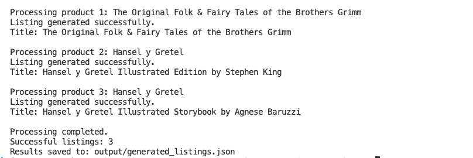
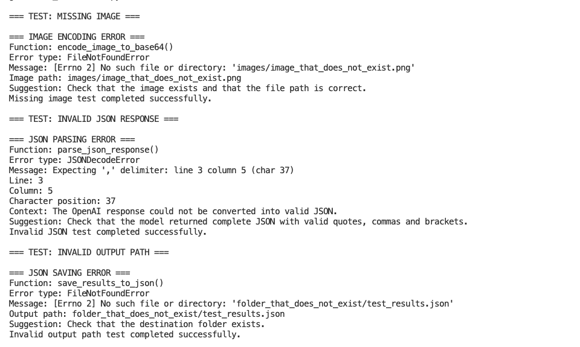

# 🛠️ Python Refactoring Project

> [!NOTE]
> A refactored version of an OpenAI-powered product listing generator, focused on clearer structure, better error handling and easier maintenance.

---

## 🎯 Project Overview

This project started as a product listing generator that used product data and images to create ecommerce listings with the OpenAI API.

The original version worked, but several parts of the process were handled inside the same workflow. The purpose of the refactoring was to reorganize the code without changing the main result.

The refactored version still:

- reads product information
- processes product images
- sends requests to the OpenAI API
- parses the generated response
- saves the final listings in JSON format

The main difference is that each step is now handled by a smaller function with a clear responsibility.

---

## 🗺️ Workflow

```text
Product Data
     │
     ▼
Validate Product
     │
     ▼
Create Prompt
     │
     ▼
Encode Image
     │
     ▼
OpenAI API Request
     │
     ▼
Parse JSON Response
     │
     ▼
Save Generated Listing
```

### Input

The workflow uses:

- product information stored in Python dictionaries
- local product images
- an OpenAI API key stored in `.env`

### Output

The generated listings are saved in:

```text
output/generated_listings.json
```

---

## 🔄 Before and After

The goal was to improve the structure of the application while keeping its original behaviour.

| Area | Original Version | Refactored Version |
|---|---|---|
| OpenAI client | The client was created directly in the main script. | Client creation was moved to `create_openai_client()`. |
| Product processing | Most steps were handled inside one continuous workflow. | `process_product()` now coordinates the steps for each product. |
| Prompt creation | The prompt was built inside the processing logic. | Prompt creation was moved to `create_product_listing_prompt()`. |
| API request | The OpenAI call was mixed with the rest of the workflow. | `generate_listing()` now handles the API request separately. |
| Image handling | Images were encoded without detailed file validation. | `encode_image_to_base64()` now handles missing files and permission errors. |
| JSON parsing | The response was parsed directly after the API request. | `parse_json_response()` cleans and validates the response. |
| Output saving | The final JSON file was written from the main workflow. | `save_results_to_json()` handles file creation separately. |
| Product validation | Required fields were assumed to exist. | Each product is checked before processing. |
| Error handling | Most failures returned generic errors. | File, JSON and API errors now include more useful context. |
| Testing | The focus was mainly on the successful workflow. | Common failure scenarios were tested separately. |

---

## ⚙️ Code Structure

The refactored application is divided into smaller helper functions.

| Function | Responsibility |
|---|---|
| `create_openai_client()` | Creates the OpenAI client using the API key from the environment. |
| `encode_image_to_base64()` | Reads an image and converts it to Base64 format. |
| `create_product_listing_prompt()` | Builds the prompt using the product information. |
| `generate_listing()` | Sends the prompt and image to the OpenAI API. |
| `parse_json_response()` | Cleans and parses the JSON returned by the model. |
| `process_product()` | Coordinates the complete workflow for one product. |
| `save_results_to_json()` | Saves the generated listings to a JSON file. |
| `run_error_handling_tests()` | Runs controlled tests using invalid inputs. |
| `main()` | Runs the full application. |

---

## 📦 Product Data

Each product is represented as a Python dictionary.

```python
{
    "id": "P001",
    "name": "Hansel and Gretel",
    "price": 9.99,
    "category": "Children's Books",
    "image_path": "images/hansel_and_gretel.jpg",
    "additional_info": "Illustrated children's story"
}
```

Before a product is processed, the application checks that the required fields are available.

```python
required_fields = [
    "id",
    "name",
    "price",
    "category",
    "image_path"
]
```

This prevents incomplete product records from reaching the image-processing or API stages.

---

## 🧪 Testing and Validation

After the refactoring, I tested the normal workflow and several failure scenarios.

The purpose of these tests was to confirm that the application still generated listings correctly and that errors were easier to understand.

---

### ✅ Successful Execution

The refactored version was executed with three valid products.

The process completed without errors and created the expected JSON output.

```text
Processing completed.
Successful listings: 3
Results saved to: output/generated_listings.json
```

### 📸 Execution Evidence



---

## 📄 Generated Output

The final results are stored in:

```text
output/generated_listings.json
```

Each record combines the original product data with the listing returned by the OpenAI API.

Example structure:

```json
{
    "product_id": "P001",
    "original_name": "Hansel and Gretel",
    "price": 9.99,
    "category": "Children's Books",
    "image_path": "images/hansel_and_gretel.jpg",
    "listing": {
        "title": "Generated product title",
        "description": "Generated product description"
    }
}
```

---
## 🚨 Error Handling

The refactored version includes dedicated error handling for common failure scenarios, such as missing files, invalid JSON responses and file output errors.

The application reports clear error messages to simplify debugging and improve maintainability.

### 📸 Error Handling Test




## 🤖 OpenAI API Error Handling

The API request is handled separately from the rest of the product-processing workflow.

The application includes specific handling for:

- `AuthenticationError`
- `RateLimitError`
- `APITimeoutError`
- `APIConnectionError`
- `APIError`

This makes it easier to distinguish between:

- an invalid API key
- quota or rate-limit issues
- a request timeout
- a connection problem
- another API-related error

The API key is loaded from the environment:

```python
api_key = os.getenv("OPENAI_API_KEY")
```

The `.env` file is excluded from the repository through `.gitignore`, so the key is not committed to GitHub.

---

## 💡 Main Challenges

### Separating the workflow

The first challenge was deciding where to divide the original code.

I separated the process according to the main steps of the application: client creation, prompt generation, image encoding, API communication, JSON parsing and file saving.

This made the execution flow easier to follow without changing the final result.

### Passing data between functions

Once the workflow was split into smaller functions, each function needed to return the correct value to the next step.

For example:

```text
generate_listing()
        │
        ▼
response text
        │
        ▼
parse_json_response()
        │
        ▼
Python dictionary
```

Keeping each return value simple helped avoid adding unnecessary dependencies between functions.

### Improving error messages

The original errors did not always explain what had failed.

The refactored version includes more context, especially for:

- missing image files
- invalid model responses
- output folder problems
- API authentication and connection errors

### Preserving the original behaviour

The application still processes the same three products and saves the generated results in the same JSON format.

The structure changed, but the expected output remained the same.

---

## Operational Considerations

If this project were used regularly, the first area I would monitor would be the OpenAI API request.

Authentication problems, rate limits, timeouts or network failures would prevent listings from being generated.

The second area would be the JSON response returned by the model. Even with a clear prompt, a model response may occasionally include invalid formatting. The parser now reports the exact location of the error, making the issue easier to investigate.

Other points worth monitoring would be:

- missing or renamed product images
- incomplete product records
- invalid output folders
- unexpected changes in the API response structure

---

## 🏁 Final Result

The refactored version keeps the same main functionality as the original product listing generator.

It still processes product data and images, calls the OpenAI API and saves the generated listings as JSON.

The main improvement is the internal structure. Each step now has a clear place in the application, common errors are easier to understand and individual parts of the workflow can be tested independently.

This gives the project a stronger base for future improvements such as automated testing, batch processing, structured logging or a user interface.